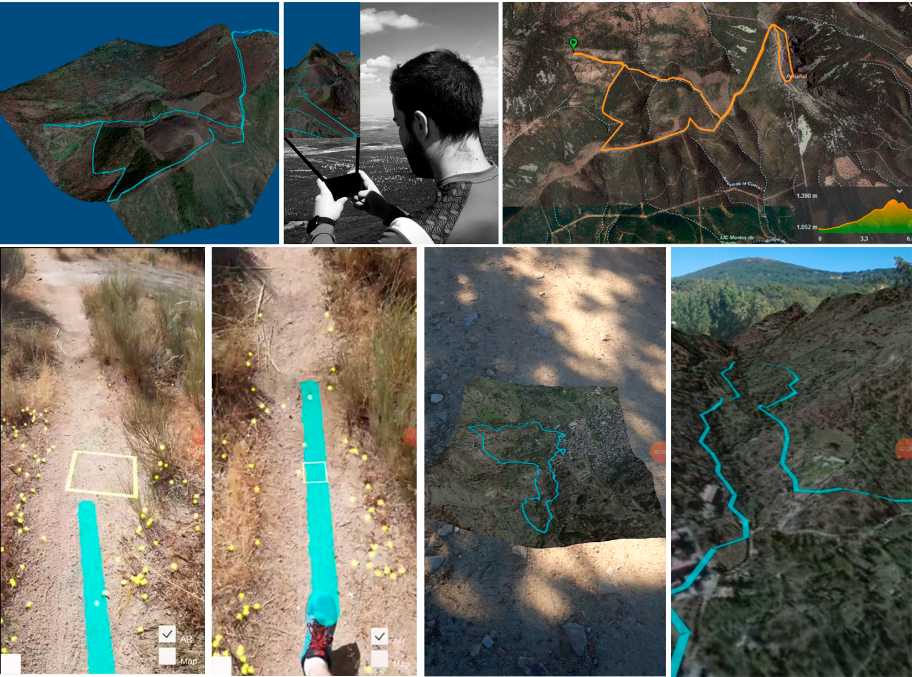
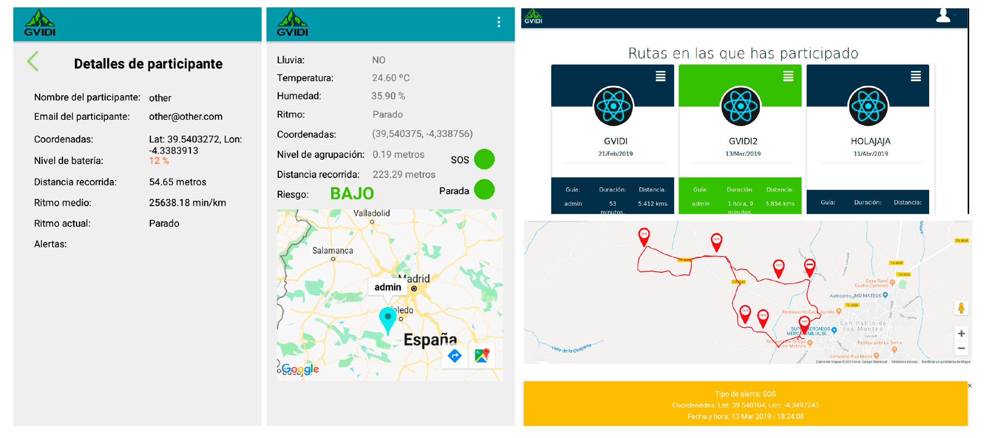

  
  

     <code>GVIDI</code> is a system to improve the safety of groups of hikers based on real-time monitoring and dataset generation.
     
  

## Description
GVIDI is a novel hardware and software solution that combines wearables, a mobile application, and AR. Hikers wear the device on their wrist. The mobile application is designed to receive and process data for both individuals and groups. GVIDI also relies on a web system that stores expedition data in the cloud for real-time and post-hike consultation from anywhere. Finally, GVIDI integrates an AR module that displays virtual information about the real environment to facilitate understanding of the current situation.

GVIDI has the ability to record all the activities of an expedition, creating datasets that reflect environmental data, personal measurements of each member of the group (location, movement, and health parameters), and group activities. Each dataset generated and recorded by an expedition is a rich source of information for analysis in various scientific fields such as public health, psychology, physiology, sociology, geography, and artificial intelligence.

The next figure gives a graphical overview of GVIDI, where three main components can be distinguished.

The general architecture of GVIDI is shown in the figure below.

  
The next two figures  show the system in operation with the AR module activated.

  
  

## Components 📋
 - Arduino microcontroller with gyroscopes, accelerometers and bluetooth connectivity.
 - Mobile app, developed for Android.
 - Cloud store.
 
## Prerequisites 
- GCC 12.2.
- Docker 20.10.14.
- Docker-compose 2.14.0.
- Unity 2021 LTS.
- Mapbox SDK v10.
- Firebase 31.1.1.
- I2C Device Library (i2cdevlib).
- DHT22 sensor library.
- TinyGPS library.
- KiCad 6.x.

## Execution ⚙️
- Arduino: see Arduino libraries.
- Mobile app: see Android [README file](Android/README.md).
- Cloud store (server/client): use docker-compose.yml located in [Webapp](Webapp).

	

## Contributors

- Iván García (ivangarrera@gmail.com)
- Javier Albusac (javieralonso.albusac@uclm.es).
- José J. Castro-Schez (josejesus.castro@uclm.es).
- Vanesa Herrera (vanesa.herrera@uclm.es).
- David Vallejo (david.vallejo@uclm.es).

## Copyright and license
Code released under the MIT License.
					  
				

